**Week1 Lab Report**
---
**Install VScode**
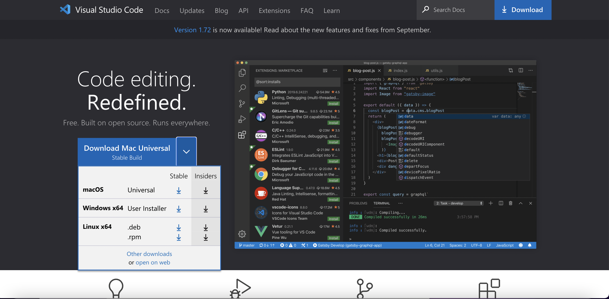
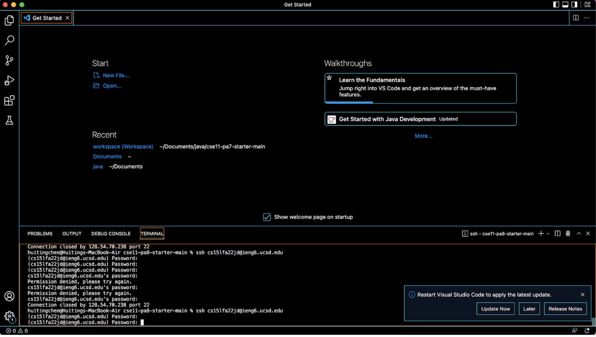
I have already installed my VScode in my previous CSE class. This is a screenshot of my VScode.
To install VScode, the link can be found in part three. The link is  https://code.visualstudio.com/ and there are different choices for different devices. The last time I downloaded the VScode, I got a box. Then I opened the box to install VScode to my device.
***
**Remotely Connecting**
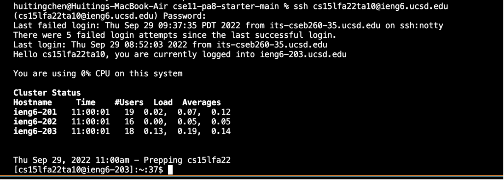
I failed to log in to my own account, so I use another one. I successfully connected to a remote computer by typing “ssh cs15lfa22ta10@ieng6.ucsd.edu” in the terminal.
***
**Trying Some Comments**
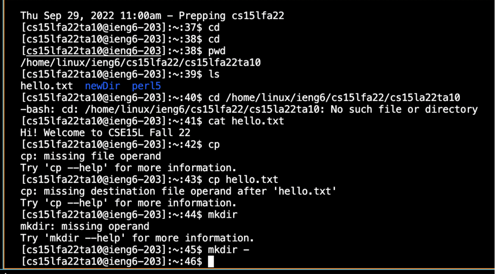
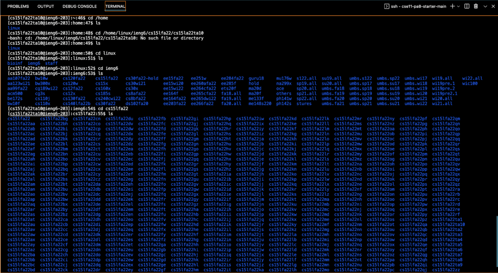
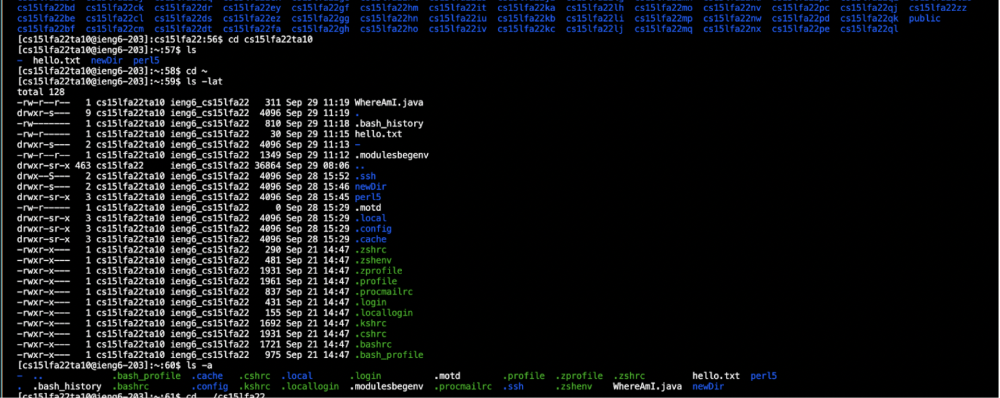
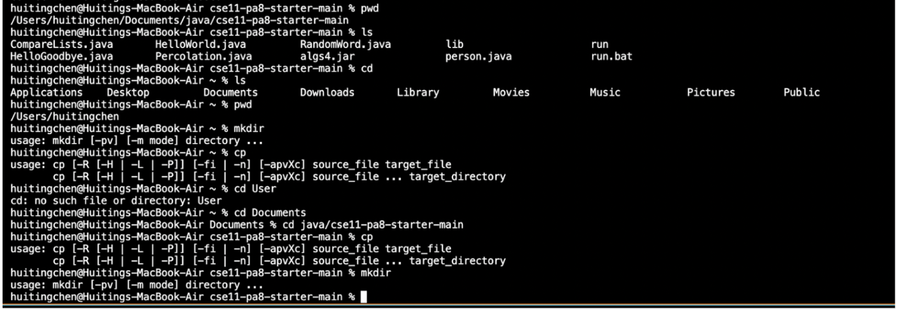
I used the pwd command to check the current directory in the remote computer and the ls command to see all the files exist. Then I used the cd command to get the home directory and see what files each directory contains. I also tried these commands on my own computer and found that the command ran in the remote computer shows the files in the remote computer while the command ran in my computer shows the files in my computer.
***
**Moving Files With SCP**
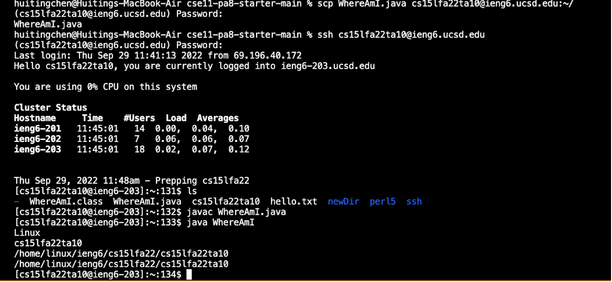
When I tried to  move WhereAmI.java to the remote computer, there was not a row under “Password:” showing the file’s information. But when I connect to the remote computer by ssh, I find that WhereAmI.java exists in the remote computer. I am not sure if this is correct.
***
**Setting an SHH key**
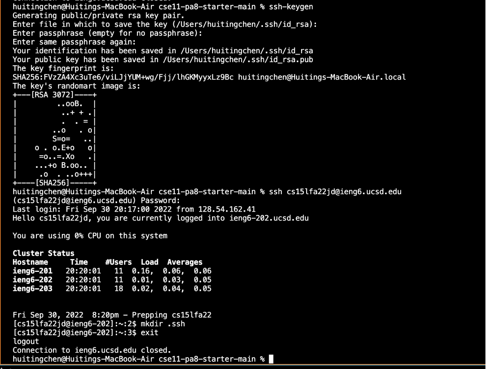
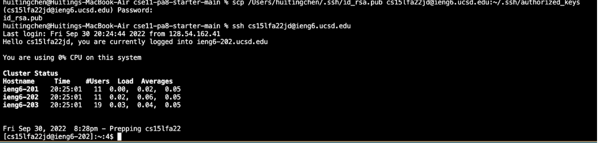
First, type in ssh-keygen. Then, press enter after "Enter file in which to save the key (...):" and the key will be stored in the location given. After that, log in to the remote device and type "mkdir.sh" then exit. Then use SCP command to copy the punlic key to store it in the ~/.ssh/authorized_keys in the resmote computer. After this, one should be able to using shh and scp without password.\
The process of creating a public key and private key goes well. In the second part, I failed at first because I tried to store my public key in cs15lfa22. Then as I find that I don’t know the password of cs15lfa22, I realize that I should store the key in cs15lfa22jd.
***
**Optimizing Remote Running**
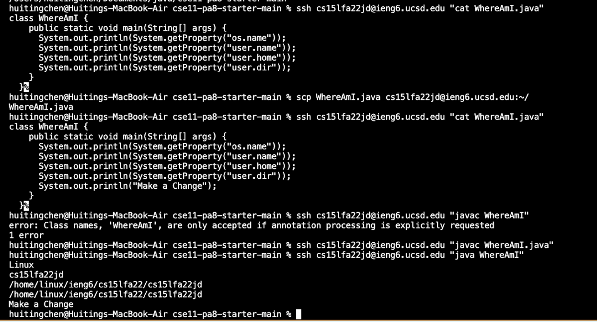
After I change the file in my computer, I use scp to move it to the remote computer and then use ssh to run it on the remote computer. It prints out its location in the remote computer and the change I made.
